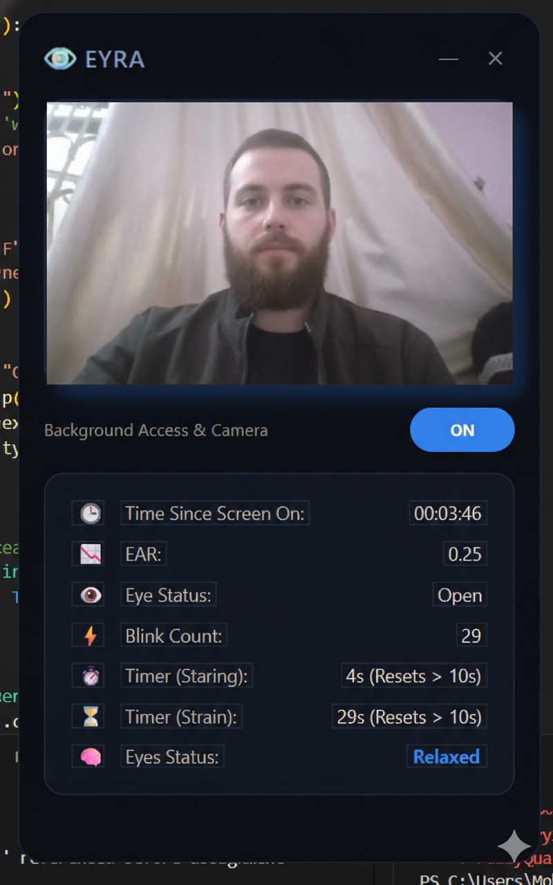

# 👁️ EYRA - Eyes-Strain Real-time Assistance

## 📄 Overview
**EYRA** is a computer vision-based desktop application designed to combat **Computer Vision Syndrome (CVS)**. It acts as an intelligent background assistant that monitors user eye fatigue in real-time.

Built with **Python** and **PyQt6**, it uses a dual-process architecture to process AI tasks without freezing the user interface. It strictly enforces the medical **20-20-20 Rule** to ensure long-term eye health for students and professionals.

---

## ✨ Key Features

### 🧠 AI-Powered Monitoring
* **Real-time Face Mesh:** Utilizes **MediaPipe** to map 468 facial landmarks.
* **Blink Detection:** Calculates **Eye Aspect Ratio (EAR)** to detect blinks with sub-millisecond latency.
* **Drowsiness Alert:** Triggers an alarm if eyes remain closed for >3 seconds.

### 🛡️ Health Protocols
* **20-20-20 Rule:** Automatically pauses the screen every 20 minutes and guides the user to look away for 20 seconds.
* **Strain Prevention:** detects low blink rates (staring) during intense coding/gaming sessions.

### ⚡ Technical Architecture
* **Decoupled Logic:** Separation of concerns between Backend (AI Processing) and Frontend (GUI).
* **Socket Communication:** Uses TCP/IP (Localhost) for zero-latency data transfer between threads.
* **Optimized Performance:** Runs efficiently on standard CPUs without needing a dedicated GPU.

---

## 🛠️ Technology Stack

* **Language:** Python 3.10+
* **GUI Framework:** PyQt6 (Modern, Frameless Design)
* **Computer Vision:** OpenCV, MediaPipe
* **Math/Logic:** NumPy
* **Audio:** Pygame Mixer

---

## 📂 Project Structure

EYRA-Project/
│
├── frontend.py        # The Main GUI (PyQt6) - Run this to start
├── backend.py         # The AI Logic (MediaPipe & OpenCV)
├── launcher.py        # Script to launch both processes automatically
├── requirements.txt   # List of dependencies
├── README.md          # Documentation
│
├── audios/            # Alert sound effects (beep.mp3)
└── logoimages/        # Icons and assets

## 🚀 Installation & Setup
    1. Clone the Repository

    2. Install Dependencies

    3. Run the App You can simply run the launcher to start everything:

## 🔮 Future Enhancements
    - Dark/Light Mode toggle.

    - Personalized calibration for different eye shapes.

    - Weekly health report generation (PDF).